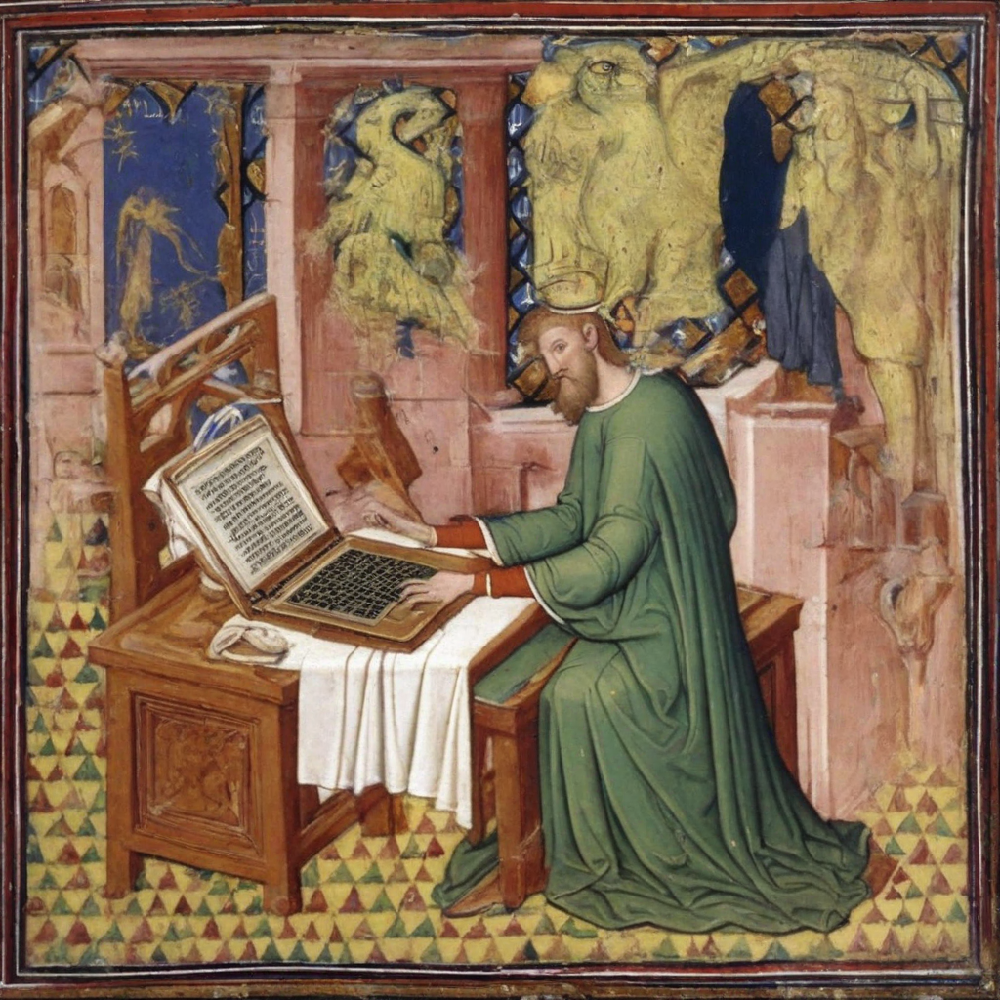
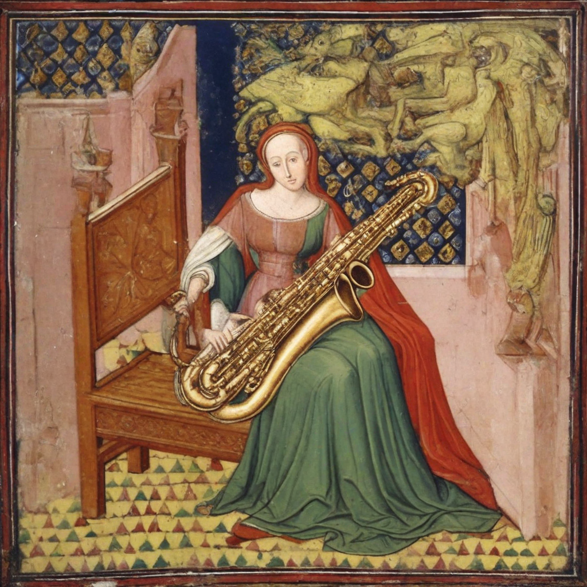
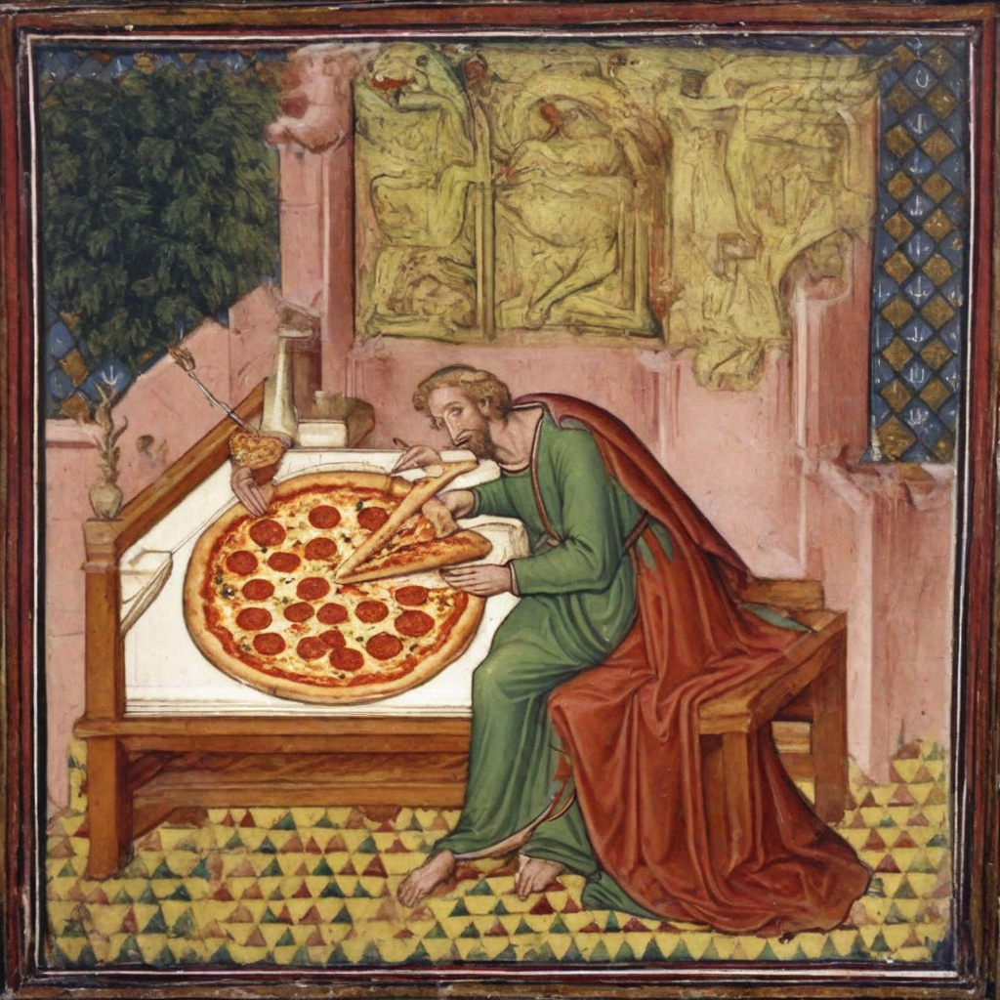
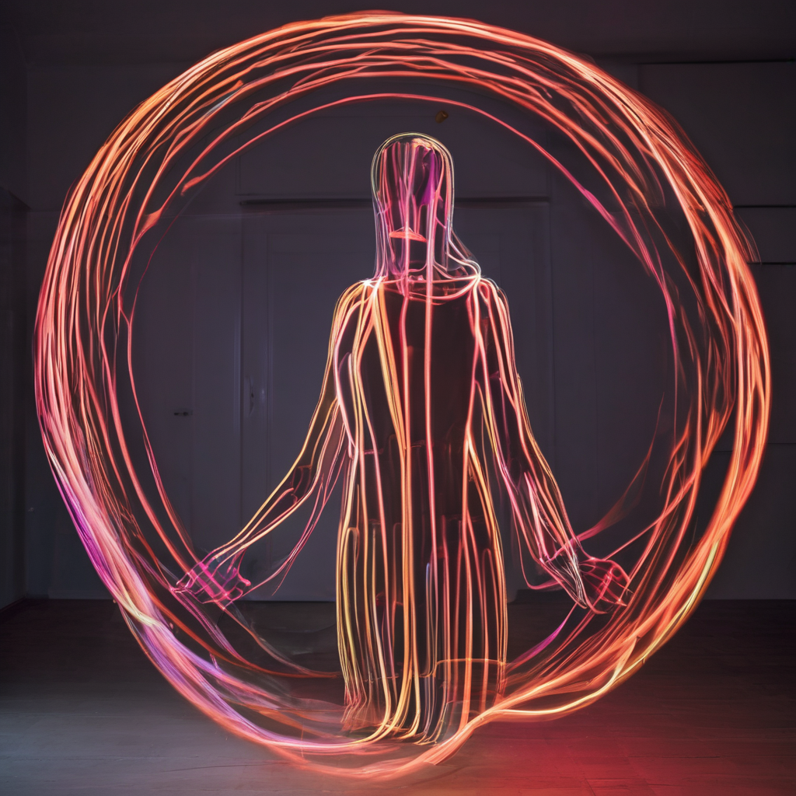
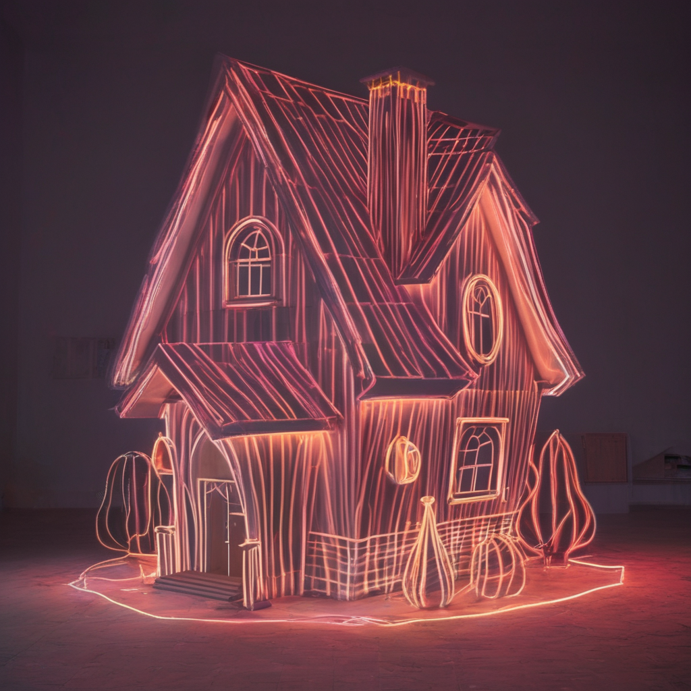
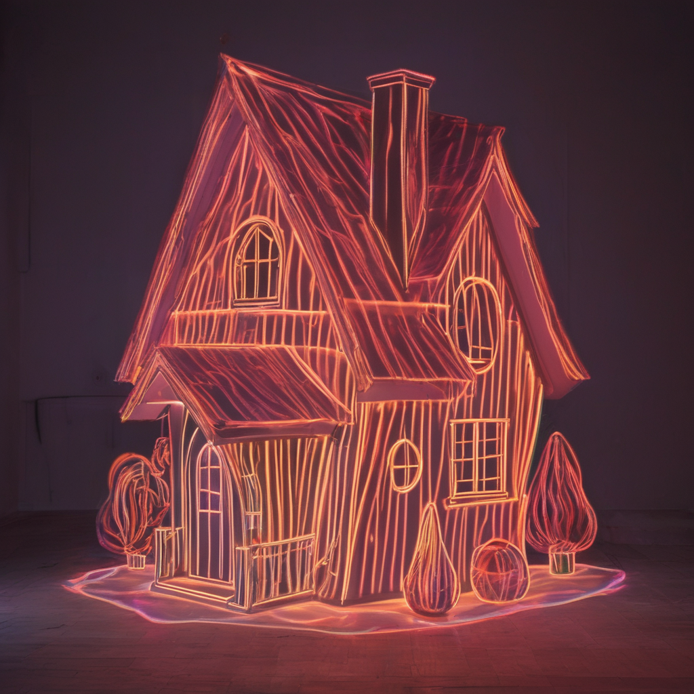

# StyleAligned: Zero-Shot Style Alignment among a Series of Generated Images via Attention Sharing

### Copyright © 2024 Alessio Borgi, Francesco Danese

### MULTI-MODAL & MULTI-REFERENCE (StyleAligned V2): https://github.com/alessioborgi/StyleAligned_MultiReference-MultiModal

### **Abstract**

In this notebook we aim to reproduce and enhance **[StyleAligned](https://arxiv.org/abs/2312.02133)**, a novel technique designed to achieve **Zero-Shot Style Alignment in Text-to-Image (T2I) Generative Models**,introduced by **Google Research**. While current T2I models excel in creating visually compelling images from textual descriptions, they often struggle to maintain a consistent style across multiple images generated. Traditional methods to address this require extensive fine-tuning and manual intervention. **StyleAligned**, addresses this issue by incorporating minimal **Shared Attention** during the diffusion process, allowing for consistent style transfer without extensive fine-tuning (**Zero-Shot Inference**). This technique involves a straightforward inversion operation that enforces stylistic coherence while maintaining high fidelity to the text prompts. Throughout this readme, some examples are shown, please open the readme fully by clicking on the file for a better rendering.

    

        
        
        
        
    

### **StyleAligned's Keypoints**

-   **Zero-Shot Style Alignment**: Achieve consistent style alignment without the need for optimization or fine-tuning.
-	**Minimal Attention Sharing**: Introduces attention sharing during the diffusion process for seamless style transfer.
-	**High-Quality Synthesis**: Maintains high fidelity to text prompts while ensuring stylistic coherence.
-	**Ease of Use**: Simplifies the process of generating a series of stylistically aligned images.
-   **Inversion Operation**: Used to apply reference styles, ensuring stylistic coherence.

We propose three primary applications of StyleAligned:
1.	**StyleAligned with Prompts Only**: Demonstrates the simplicity and effectiveness of achieving style alignment using only **Input Text Prompts**.
2.	**StyleAligned with Reference Image**: Utilizes **Reference Images** (in order to **Input Text Prompts**) to guide the style alignment process, ensuring consistent style transfer across multiple outputs.
3.	**StyleAligned with ControlNet**: Incorporates **ControlNet**, which can be provided with **Depth Images** or **Edge Images (Canny Images)**, to enhance control over the style alignment process.

Our approach shows that high-quality, stylistically aligned image sets can be achieved with minimal intervention, enhancing the utility of T2I models for applications such as visual storytelling, artistic creation, and design. The method operates without the need for extensive optimization or fine-tuning, distinguishing it as a zero-shot solution. Evaluation across diverse styles and text prompts demonstrates the high-quality synthesis and fidelity of our method, underscoring its efficacy in achieving consistent style across various inputs. 

### **Evaluation Metrics**

A **Metrics Analysis** has also been provided w.r.t. the following, demonstrating the valuable insights of this technique:
- **Style Consistency: DINO Embedding Similarity**
- **Text-Image Coherence: CLIP Embedding Similarity**
  
To verify that each generated image contains its specified object, we measure the **CLIP Cosine Similarity** between the image and the text description of the object. In addition, we evaluate the style consistency of each generated set, by measuring the **Pairwise Average Cosine Similarity** between **DINO VIT-B/8 Embeddings** of the generated images in each set. We used DINO embeddings instead of CLIP image embeddings for measuring image similarity, since CLIP was trained with class labels and therefore it might give a high score for different images in the set that have similar content but with a different style. On the other hand, DINO better distinguishes between different styles due to its self-supervised training.

|         MODEL 	|  CLIP  |  DINO  |
|-----------------------|--------|--------|
| SDXL (Non-Aligned) 	| 0.3454 | 0.3453 |
| Style-Aligned SDXL    | 0.3422 | 0.5018 |

### **Installation**

To get started with StyleAligned, follow these steps:
1.	Clone the Repository: `git clone https://github.com/alessioborgi/StyleAlignedDiffModels.git`
2.  Navigate to the project directory:    `cd StyleAlignedDiffModels`
3.  Install the required dependencies:    `pip install -r requirements.txt`

### Notebook Instructions
1.	**StyleAligned_with_Prompts_only.ipynb**
	-	**Purpose**: Demonstrates the simplicity and effectiveness of achieving style alignment using only text prompts.
	-	**Run**: Use this notebook to generate stylistically coherent images from textual descriptions without the need for reference images.
	-	**Command**: `jupyter notebook StyleAligned_with_Prompts_only.ipynb`

    

        
        
        
        
    

	
2.	**StyleAligned_with_Reference.ipynb**
	-	**Purpose**:  Illustrates style alignment using reference images to guide the process.
	-	**Run**: Use this notebook to apply a reference style across multiple generated images, ensuring consistent style transfer.
	-	**Command**: `jupyter notebook StyleAligned_with_Reference.ipynb`

    

        
        
        
        
    

3.	**StyleAligned_ControlNet.ipynb**
	-	**Purpose**: Demonstrates how to control style alignment using specific parameters and ControlNet inputs (depth images or edge images (Canny Edges)).
	-	**Run**: Use this notebook to explore enhanced control over the style alignment process with ControlNet.
	-	**Command**: `jupyter notebook StyleAligned_ControlNet.ipynb`

    

        
        
        
        
    

4.	**StyleAligned_Explanation.ipynb**
	-	**Purpose**:  Provides an in-depth explanation of the underlying methods and techniques used in StyleAligned, with detailed comments for each step involved.
	-	**Run**: Start here to understand the theoretical background, the inversion operation, and how attention sharing is achieved with minimal intervention. This comprises all the methods (both StyleAligned with Prompts, with Reference and with ControlNet).
	-	**Command**: `jupyter notebook StyleAligned_Explanation.ipynb`

### Style Alignment Explanation's Index

- **0: SETTINGS & IMPORTS**
    - **0.1: CLONE REPOSITORY AND GIT SETUP**
    - **0.2: INSTALL AND IMPORT REQUIRED LIBRARIES**
- **1: UTILS IMPLEMENTATION**
    - **1.1: ADAIN MODULE**
    - **1.2: SHARED ATTENTION MECHANISM**
- **2: DDIM \& PIPELINE DEFINITION**
    - **2.1: DDIM SCHEDULER**
        - **2.1.1: DIFFUSION PROCESS**
        - **2.1.2: REVERSE PROCESS**
        - **2.1.3: BETA SCHEDULE**
        - **2.1.4: INFERENCE WITH DDIM**
    - **2.2: SDXL PIPELINE DEFINITION**
- **3: STYLE-ALIGNED WITH ONLY PROMPTS (WITHOUT REFERENCE IMAGE)**
- **4: STYLE-ALIGNED WITH REFERENCE IMAGE**
    - **4.1: LOADING REFERENCE IMAGE & SETTING PARAMETERS**
    - **4.2: FUNCTION FOR PROMPT TOKENIZATION & EMBEDDING**
    - **4.3: TEXT EMBEDDING ENSEMBLE METHOD**
    - **4.4: TEXT EMBEDDING: NEGATIVE CONDITIONING TECHNIQUE**
    - **4.5: ENCODE THE REFERENCE IMAGE**
    - **4.6: GENERATE NOISE PREDICTIONS**
    - **4.7: SINGLE DENOISING STEP in DIFFUSION PROCESS**
    - **4.8: DDIM (Denoising Diffusion Implicit Models) Denoising Process**
    - **4.9:  UPDATE LATENT TENSORS CALLBACK**
    - **4.10: STYLE-ALIGNED WITH REFERENCE IMAGE MAIN**
- **5: STYLE-ALIGNED WITH CONTROLNET**
    - **5.1: CONCATENATION WITH ZERO TENSORS: UTIL FUNCTION**
    - **5.2: CONTROLNET MODEL**
    - **5.3: CONTROL-NET WITH SIMPLE IMAGE & STYLE-ALIGNMENT**
    - **5.4: CONTROL-NET WITH DEPTH MAP & STYLE-ALIGNMENT**
    - **5.5: CONTROL-NET WITH EDGE MAP (CANNY DETECTOR) & STYLE-ALIGNMENT**

### **License**

This project is licensed under the MIT License - see the LICENSE file for details.

### **Acknowledgments**

We would like to thank Google Research for introducing the original concept of StyleAligned.
